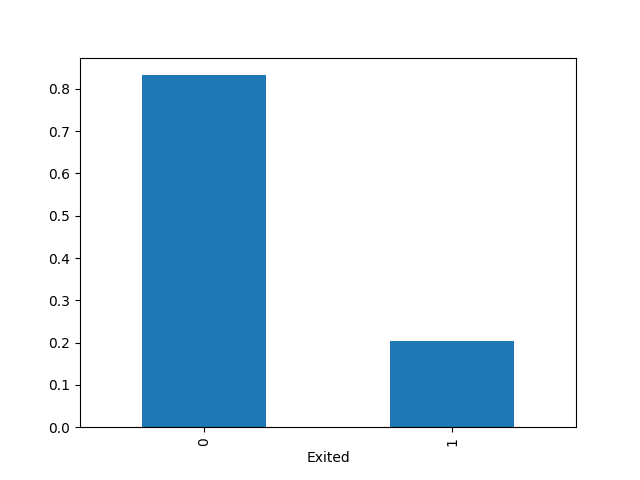

# HI!! My name is Angel and here you will find some of the projects that I have made :) .

### Tools
- python
- pandas
- Matplotlib 
- scikit-learn
### Project Description and Steps
Beta Bank's customers are leaving, every month, little by little. Bankers found out that it is cheaper to save existing customers than to attract new ones.
We need to predict whether a customer will leave the bank soon. We have the data on the customers' past behavior and termination of contracts with the bank.
We will build a model with the maximum possible F1 value. We need an F1 value of at least 0.59.
1. Initialization and data loading
2. Data standardization 2.1. OHE encoding and feature scaling
3. Examining class balance  3.1. Consistency testing 3.2. Model evaluation
4. Improving model quality 4.1. Oversampling and undersampling 4.2. Logistic regression 4.3. Random forest
5. Roc curve  

## [Project bankruptsy](https://github.com/adof96/Project_bankruptcy)
### Tools
- numpy 
- pandas
- matplotlib
- seaborn
- scikit-learn
- imblearn
### Project Description and Steps
This project works on Company Bankruptcy Prediction dataset  to create prediction about possible bankruptcy status of companies
## Steps
1. Data Preparation
2. Exploratory Data Analysis (EDA)

3. Random Forest Modeling
3.1. Baseline Model
3.2 Model With Undersampling
3.3 Model With Oversampling
3.4 Model With SMOTE
4. Feature Selection

5. Conclusion

## [Project Megaline](https://github.com/adof96/Proyecto-4)
### Tools
- Python
- Pandas 
- Matplotlib 
- Seaborn
- Numpy
- Scipy
### Project Description and Steps
We will work as an analyst for the telecom operator Megaline. The company offers its customers two prepaid tariffs, Surf and Ultimate. The sales department wants to know which of the plans generates the most revenue in order to adjust the advertising budget.
- Step 1. Open the data file and study the general information
- Step 2. Prepare the data
- Step 3. Analyze the data
- Step 4. Test the hypotheses
- Step 5. General conclusion
  

## [Project Megaline_2](https://github.com/adof96/Megaline_2)
### Tools
- python
- pandas
- scikit-learn
### Project Description and Steps
Mobile company Megaline is not happy that many of its customers are using legacy planes. They want to develop a model that can analyze customer behavior and recommend one of Megaline's new planes: Smart or Ultra.
1. Initialization and data loading
2. Segment the data
3. Models
3.1 Decision tree
3.2 Random forest
3.3 Logistic regression
4. Check the quality of the model
5. Conclusion

